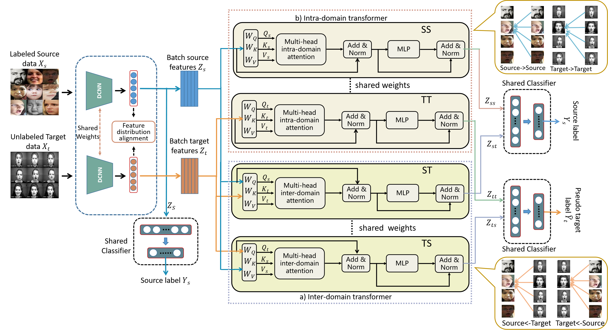

# Cross-domain Sample Relationship Learning for Facial Expression Recognition
##

## Environment

Python 3.6.13 and PyTorch 1.9.1


## Training

To train the model(s) in the paper, run this command:

```train
python ZL_CD_Pes_main.py 
```

## Pre-trained Models

You can download pretrained models (ResNet-18 pretrained on MS-Celeb-1M) here:

- [BaiDu Drive](https://pan.baidu.com/s/1wEWTknM-qgjqIrS0VaNkrA) (password:hvag). 


## Contributing
